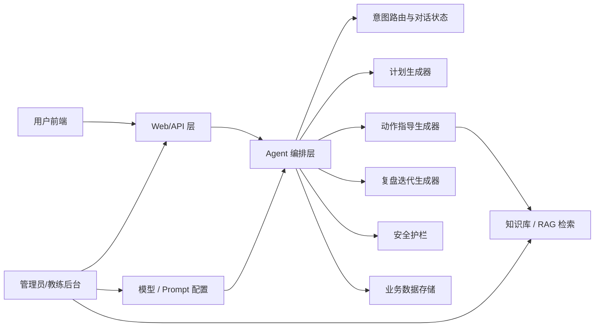
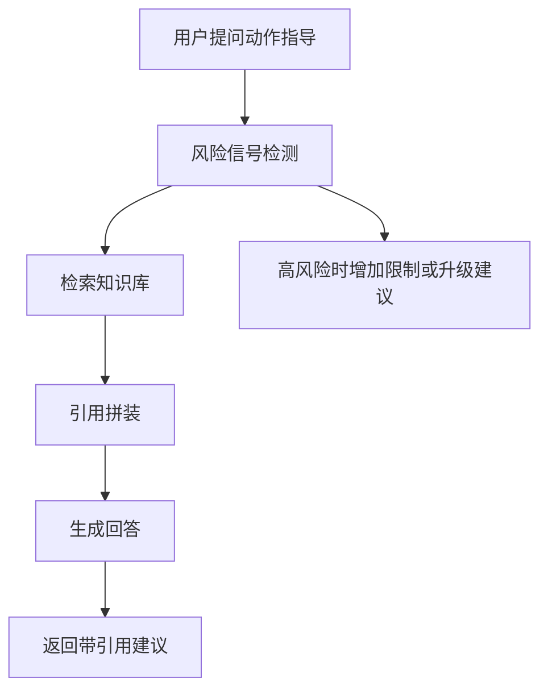

# 系统架构草案

## 设计目标

这版架构不追求复杂分布式能力，而是围绕 Demo 的四个核心诉求展开：

1. 用户端可顺畅演示
2. Agent 输出结构化、可解释、可追踪
3. 管理员可配置知识库与模型
4. 高风险内容可控

并补充一条业务约束：

5. 支持 `AI 助手 + 真人教练` 的协同服务模式

## 总体架构



## 核心模块

### 1. 用户前端

建议初期包含四个页面：

- 登录/注册
- 画像采集
- 我的计划
- 动作指导 / 训练记录 / 复盘

这里的用户前端不是开放式通用 AI 产品，而是会员服务入口，所以建议在信息架构上显式体现：

- 我的教练
- 当前计划版本
- 本周训练进度
- AI 建议与人工建议

这里的重点不是页面数量，而是把结构化结果稳定展示出来。

### 2. 管理员后台

建议初期包含四个模块：

- 知识库管理
- 模型与 Prompt 配置
- 用户数据查看
- 对话与计划记录查看

同时预留教练视角：

- 查看本人会员列表
- 查看会员当前计划与复盘
- 补充人工备注

管理员后台是这个项目的重要展示点，因为它能体现“可运营”而不是单纯聊天页面。

### 3. Agent 编排层

这是系统核心，建议不要直接让前端对接一个通用聊天模型，而是通过编排层做任务分发。

建议拆成三个任务型 Agent：

- `PlanAgent`
- `GuidanceAgent`
- `ReviewAgent`

再在前面加一个 `Intent Router`：

- 识别用户当前想做什么
- 判断当前画像是否足够
- 决定调用哪个 Agent
- 决定是否需要先走 RAG 或护栏检查
- 决定是否要把结果挂给真人教练复核或补充

## 对话管理建议

建议使用 `任务态` 而不是纯聊天态。

最小状态可包括：

- `profile_status`
- `current_intent`
- `current_plan_id`
- `current_plan_version`
- `risk_level`
- `last_review_at`
- `coach_review_status`

这样做的好处是：

- 便于页面刷新后恢复上下文
- 便于把计划和复盘结果持续保存在个人页面
- 便于管理员后台查看业务轨迹

## 计划生成架构

计划生成建议拆成两个阶段：

1. 先生成周期/周结构
2. 再生成日级动作表

原因：

- 更稳定
- 更容易解释
- 更方便后续复盘只调整局部计划

建议输出 schema 至少包含：

```json
{
  "goal_summary": "8周减脂",
  "cycle_weeks": 8,
  "weekly_structure": [
    {
      "day_label": "Day 1",
      "focus": "上肢推拉+核心",
      "session_minutes": 45
    }
  ],
  "daily_workouts": [
    {
      "day_label": "Day 1",
      "exercises": [
        {
          "name": "哑铃罗马尼亚硬拉",
          "sets": 4,
          "reps": "8-10",
          "rpe": "7",
          "rest_seconds": 90,
          "alternative": "壶铃硬拉",
          "notes": "膝盖不适时优先髋主导动作"
        }
      ]
    }
  ]
}
```

## 动作指导架构

动作指导是风险最高的模块，建议采取 `检索优先` 策略。

流程建议：



建议知识库先按下面几类整理：

- 动作标准与要点
- 热身与放松建议
- 常见错误与替代动作
- 禁忌与风险边界
- 疼痛与停止训练信号
- 基础营养常识

## 复盘迭代架构

复盘模块建议遵循：

`记录入库 -> 指标计算 -> 结果判断 -> 计划更新`

最小可用输入：

- 训练完成率
- 主观疲劳
- 体重趋势
- 用户备注

最小可用输出：

- 本周总结
- 偏差原因
- 调整原则
- 新版计划

## 安全护栏

这是必须项，不应作为附加功能。

建议最少做三层：

### 第一层：输入侧风险识别

识别以下信号：

- 疼痛
- 眩晕
- 胸闷
- 旧伤复发
- 孕期
- 未成年人

### 第二层：生成侧限制

- 高风险问题优先检索
- 明确不替代医疗建议
- 限制模型给出超出边界的处理方案

### 第三层：输出侧提示

- 风险提示
- 停止训练建议
- 转人工或专业机构建议

## 管理后台与 RAG 的关系

为了让后台不是“摆设”，建议至少能配置：

- 文档上传与分组
- 文档启停状态
- 检索召回数量
- 引用展示开关
- 不同任务使用的 Prompt 模板
- 教练查看和补充结果的权限位

这会直接影响演示说服力，因为可以清楚展示“知识更新后，指导结果也会更新”。

## 第一阶段的技术取舍建议

如果进入开发，我建议第一阶段用下面这套思路：

- 前端：一个 Web 应用，同时承载用户端和管理员端
- 前端：一个 Web 应用，同时承载会员端和管理员/教练端
- 后端：一个轻量 API 服务，负责鉴权、编排、存储
- Agent：先用服务端编排，不必一开始做复杂多 Agent 自主协作
- RAG：先做小型高质量知识库，不追求大而全
- 存储：先满足用户、计划、记录、对话、知识库元数据即可

## 适合 Demo 的一句话架构定义

这是一个以 `结构化计划 + 可解释指导 + 可迭代复盘 + 可配置后台` 为核心的智能健身助手系统，而不是一个普通问答机器人。
